# DeviceLog — Digital Maintenance & Issue Tracker

## Setup
Bu proje Flutter ve Firebase kullanılarak geliştirilmiştir. Çalıştırmak için Flutter ortamının hazır olması gerekir.
Projeyi çalıştırmak için repoyu klonlayıp bağımlılıkları yüklemek yeterlidir:

```bash
git clone https://github.com/OsmanAkal/device-log.git
cd device-log
flutter pub get
flutter run
```

Firebase entegrasyonu için Android uygulaması Firebase Console üzerinden eklenmeli ve indirilen google-services.json dosyası 
android/app/ dizinine yerleştirilmelidir.  

## Firebase Authentication
Kullanıcı bu servisle giriş yapabilir ve bu servisle hesap oluşturabilir .Authentication servisi aktif edilir ve Sign-in method olarak Email/Password etkinleştirilir . ilk kullanıcı Manuel Oluşturulur ve bu kullanıcı firestore "User" altında manuel olarak veirleri girilir "rol:admin" olmalıdır diğer kullanıcılar -admin veya personel- bu hesap aracılığı ile oluşturulur .Oluşturma yetkisi sadece adminde olup , oluşturulan hesap rol yönetimi ve mevcudiyetine de müdahale edebilir

## Firebase Firestore
Bütün veriler burda tutulur ve buradan takip edilmektedir.Gerekli koleksiyonlar oluşturulurmalıdır: Inventory , Users , MaintenanceLogs . Firestore rules düzenlenmelidir ki uygulama içinde veri işlemleri gerçekleşe bilsin ve sadece kayıtlı kullanıcların veri üzerinde işlem yapabilmesine izin verilmelidir ki .
```bash
allow read, write: if request.auth != null;
```

## Firebase Storage 
Uygulamada  görseller Firebase Storage üzerinde saklanmaktadır.Uygulamada yüklenen görseller Firebase Storage’a kaydedilmeden önce optimize edilerek saklanır.
İşlem Akışı
Kullanıcıdan alınan görsel Firebase’e gönderilmeden önce sıkıştırılır (compression)
Görsel boyutu küçültülerek performans optimizasyonu yapılır
Her görsel için çakışma olmaması adına zaman damgasına dayalı rastgele bir isim oluşturulur
Görsel Firebase Storage’a kaydedilir.

Saklama yapısı:
maintenance/
 └── {deviceId}/
      └── {userId}/
           └── image1.jpg
           └── image2.jpg

## Admin Access

Uygulamada ilk kullanıcı hesabı otomatik olarak oluşturulmaz.Firestore’daki `Users` koleksiyonu içerisine kullanıcı bilgileri manuel olarak eklenir. Bu kayıtlarda `createdAt`, `rol` gibi alanlar yazılır ve kullanıcının sistem içindeki yetkisi bu alanlar üzerinden belirlenir.
Kullanıcı rolü Firestore’da `rol` alanı ile tanımlanır ve bu değer `admin` veya `personel` olabilir.

Bu ilk admin hesabı üzerinden kullanıcı yönetimi gerçekleştirilir. Admin yetkisine sahip kullanıcılar:
- Yeni kullanıcı oluşturabilir  
- Kullanıcıları silebilir  
- Kullanıcı bilgilerini güncelleyebilir  

Sistemde oluşturulan veya `admin` rolüne sahip olarak tanımlanan tüm kullanıcılar aynı yetkilere sahiptir. Admin kullanıcılar sistemde tam yetkili olarak kabul edilir.Sistemde ayrıca ayrı bir root (super admin) kullanıcısı bulunmamaktadır. Tüm admin kullanıcılar aynı yetki seviyesine sahiptir.

## Test Admin Account

Uygulamayı test edebilmek için örnek bir admin hesabı aşağıda verilmiştir:

Email: admin@admin.com  
Password: admin26

Bu hesap Firebase Authentication üzerinden manuel olarak oluşturulmuştur.

## CI/CD Pipeline
Bu proje için GitHub Actions tabanlı bir CI/CD süreci tanımlanmıştır. Pipeline, her main branch’e yapılan push otomatik olarak çalışır ve aşağıdaki adımları içerir:

### 1. Kod çekme ve ortam kurulumu
- Repository GitHub Actions runner’a çekilir
- Flutter SDK kurulumu yapılır

### 2. Firebase yapılandırması
- Firebase `google-services.json` dosyası secret olarak base64 formatında saklanır
- Build sırasında otomatik olarak `android/app/` dizinine oluşturulur

### 3. Bağımlılık ve kalite kontrolleri
- `flutter pub get` ile bağımlılıklar yüklenir
- `flutter analyze` ile kod analizi yapılır
- `flutter test` ile unit testler çalıştırılır

### 4. Build süreci
- `flutter build apk --release` komutu ile release APK oluşturulur

### 5. Firebase App Distribution
- Oluşturulan APK Firebase App Distribution’a yüklenir
- Test kullanıcı grubuna otomatik olarak dağıtılır

### Notlar
- Firebase App Distribution için tester grubu önceden Firebase Console üzerinden tanımlanmalıdır
- Firebase API erişimi GitHub Secrets üzerinden güvenli şekilde sağlanmaktadır

## Usage 

### 1. Giriş
Uygulama açıldığında kullanıcı Firebase Authentication üzerinden giriş yapar.

- Admin kullanıcı: Yeni admin , personel , envanter oluşturur. Tüm personel raporlarını görebilir.
- Personel kullanıcı: Envanter üzerinden rapor oluşturur ,cihaz durumunu günceller.Kendi raporlarını görebilir

### 2. Kontrol Paneli
Giriş sonrası kullanıcı Kontrol Paneli ekranına yönlendirilir.Her kullanıcı için bu ekran farklıdır.

- Personel için hızlı rapor oluşturmaya yardımcı olur ve raporlarını görebilir.
- Admin için toplam envanter dağılımı grafiği , mevcut gün için yapılmış işlemler ve rapor listesini görebilir

### 3. Envanter
Kullanıcıların envanter üstünde işlem yapabilmesini sağlar.

- Admin  envantere cihaz ekler ve cihaz siler.
- Personel, sistemde kayıtlı cihazları görüntüler seçer ve rapor oluşturur .

Eğer cihaz **Arızalı** ise:
- Fotoğraf çekimi zorunludur (Firebase Storage)


### 4.Raporlarım / Durum Raporları
Kullanıcların raporları listelemesini ve incelemesini sağlar 

- Admin tüm raporlara listeleme ve erişebilme yetkisine sahiptir
- Personel sadece kendi raporlarına erişebilir

### 5.Kullanıcı Yönetimi
Admin yetkisine sahip kullanıcı sadece buraya erişebilir.

- Personel veya admin oluşturma
- Kullanıcı rolünü değiştirme
- Kullanıcı kaldırma

### 6. Ekran Görüntüleri
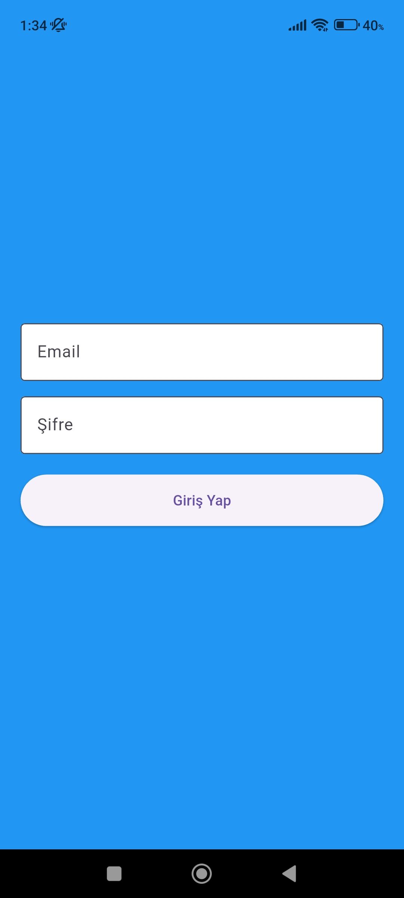

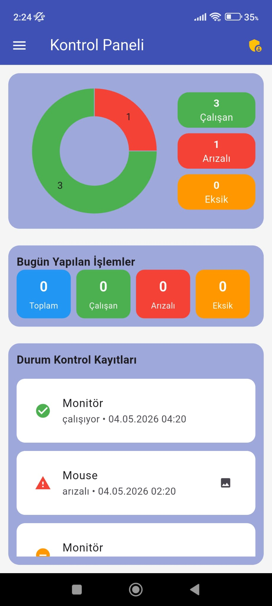
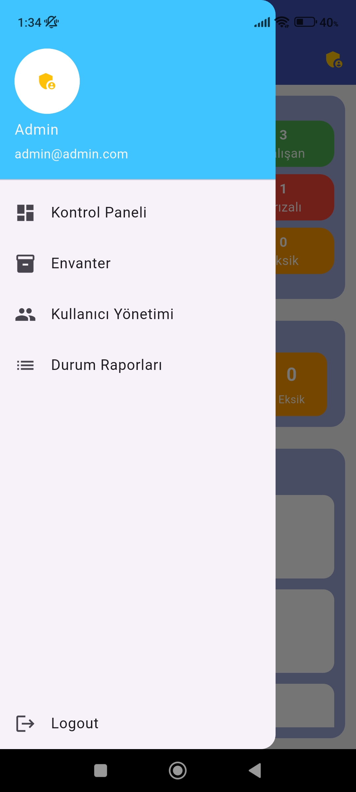
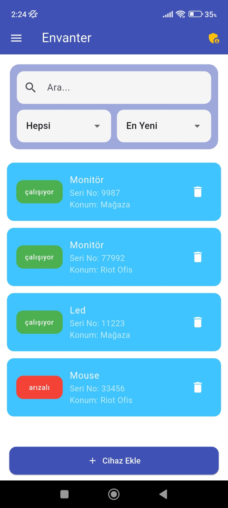
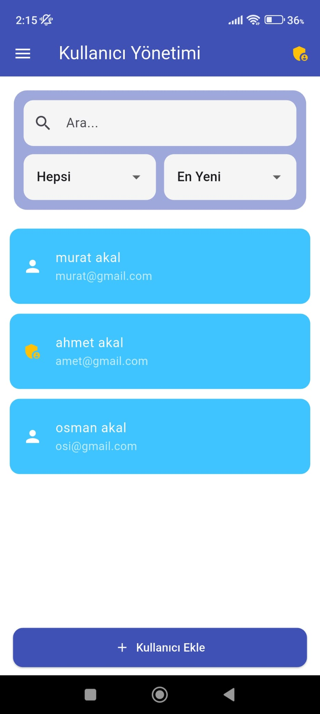
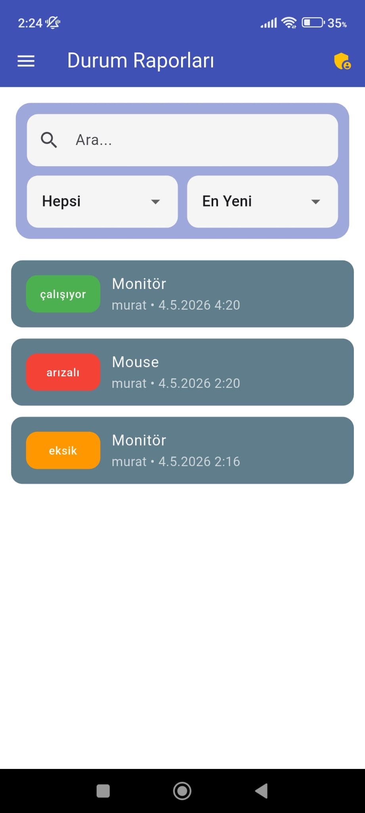
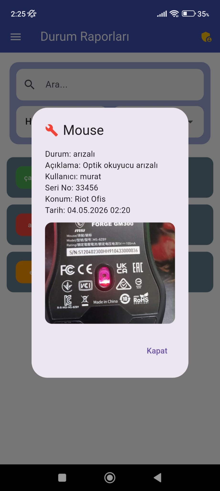

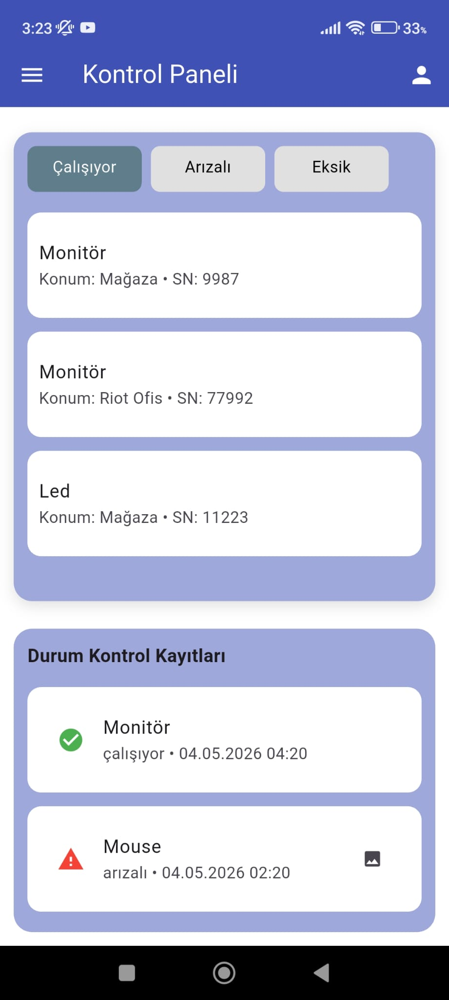
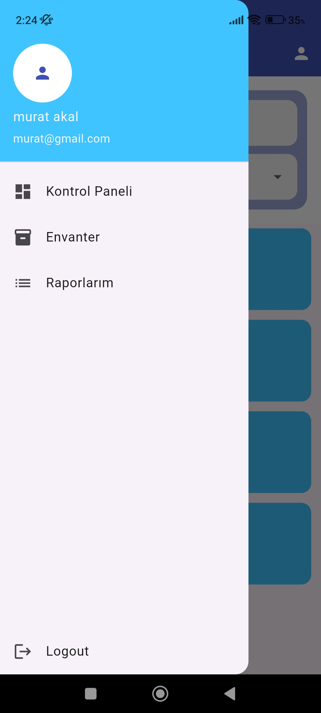
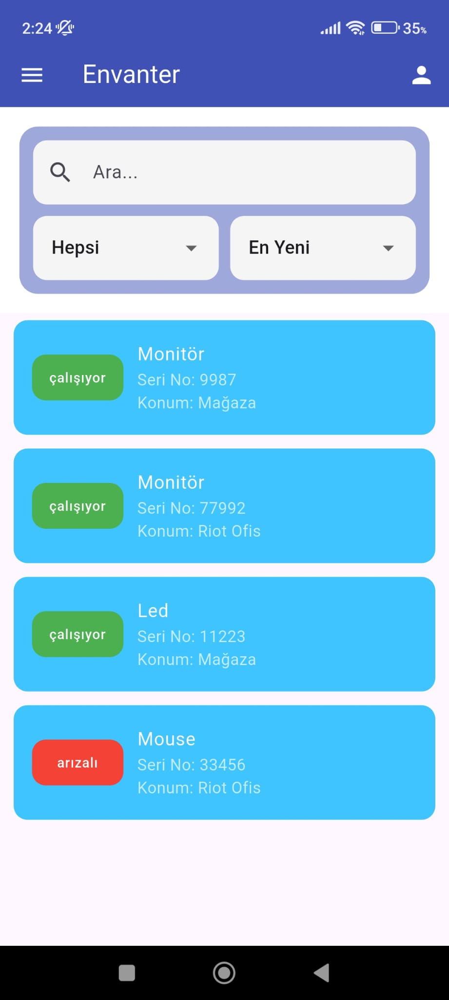
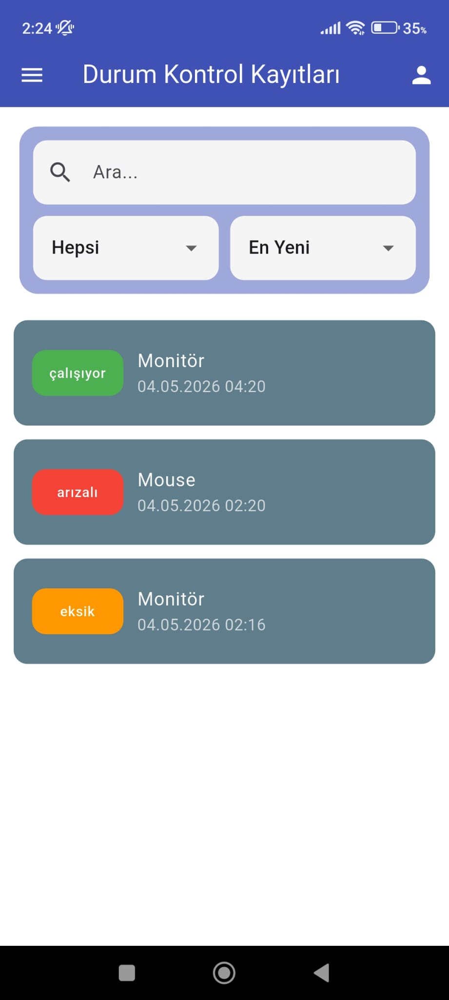
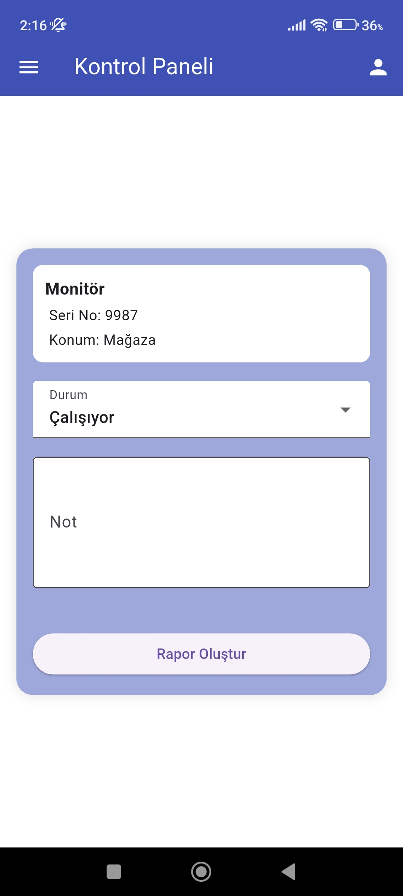


